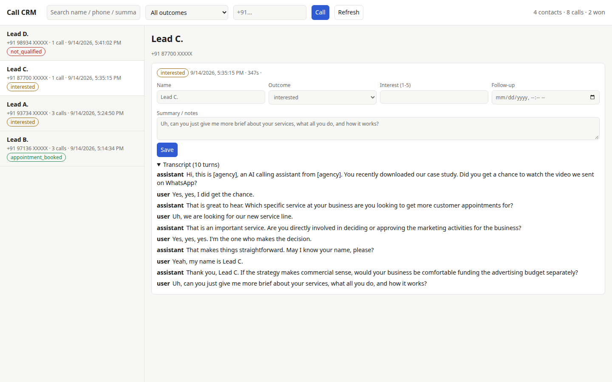

# Real-Time Bilingual Voice Agent (Telephony)

An outbound voice agent in production. It places live phone calls, holds a
natural conversation in English and Hindi, answers questions from a private
knowledge base, qualifies the person on the line, and books a follow-up
meeting, all without a human involved. Every call then lands in a built-in CRM
where the pipeline can be worked from one screen.

I built and run it on my own for a private client. This page describes what it
can do; the code itself is private (see [Why the code isn't here](#why-the-code-isnt-here)).

## TL;DR

- A phone agent that makes real calls, switches between English and Hindi, and
  books meetings on its own.
- A built-in CRM collects every call by contact, with outcome, interest score,
  follow-up date, notes and the full bilingual transcript. Fields are editable,
  and a contact can be redialled in one click.
- The pipeline runs telephony, STT, an LLM with tools and RAG, TTS, and back to
  telephony, with Postgres and vector search behind it.
- On live calls the round trip is about 2.19 s. The biggest gain came from
  starting speech on the first token. The LLM isn't the slowest stage, so
  swapping providers wouldn't help much.
- It's tested with unit tests, headless evals that run the real pipeline, and a
  live debug panel.
- The code is private because it holds client data and credentials. I'm happy
  to demo it or walk through it on a call.

---

## Hear it

### [▶ Listen to both calls in your browser](https://demonbeastop.github.io/Real-Time-Bilingual-Voice-Agent-Telephony/)

Two recorded calls with the agent. Beeps and short cuts hide personal details
and the client's name.

- **Hindi / English sales call** (2:34). The
  agent opens in English, the caller answers in Hindi, and it switches to
  Hindi for the rest of the call while it qualifies them and offers a
  strategy call.
- **English clinic receptionist** (1:51). A
  caller with back pain is matched to the right doctor from real availability,
  gives their details, hears them read back, and confirms a Monday slot.

---

## What it does

- Places and answers real PSTN calls over a telephony provider's media
  WebSocket (8 kHz mu-law). It runs on the phone network, not in a browser.
- Feeds a lightweight CRM that groups calls by contact and shows outcome,
  interest score, follow-up date, notes and the full bilingual transcript. You
  can edit fields in place and redial with one click.
- Opens in English and follows the caller into Hindi mid-sentence, writing
  Hindi in Devanagari and keeping proper nouns in English.
- Answers from a knowledge base through vector search rather than model priors,
  so it doesn't invent facts about the business.
- Uses LLM tool calls during the call to record a qualified lead, book an
  appointment against real availability, and end the call politely.
- Runs campaigns, each with its own identity and script. Every call gets one
  database row with the outcome, fields pulled from the transcript, and the
  model that served the call.

## CRM

Every call ends up in a small CRM. Contacts are listed on the left with their
latest outcome. On the right, each call shows its outcome, interest score,
follow-up date, notes and full transcript, including calls that switch from
English to Hindi partway through. Fields can be edited in place, and you can
redial a contact from the same screen.



*Real calls from testing. Names, numbers, email, the client's brand and
industry are masked.*

## Architecture

A cascade pipeline built on an open-source, frame-based real-time voice framework:

```
telephony  →  STT  →  LLM (+ tools, + RAG)  →  TTS  →  telephony
                            ↕
                   Postgres + vector search
```

| Layer | Choice | Why |
|---|---|---|
| Telephony | provider media WebSocket | real PSTN, 8 kHz mu-law |
| STT | streaming bilingual model | also owns turn detection |
| LLM | hosted fast-tier model; a second provider swappable via one env var | structured tool calls |
| TTS | streaming, token-level | speech starts on the first token |
| Data | managed Postgres with vector search | leads, campaigns, embedded knowledge base |
| Ops | live debug panel, headless eval harness, CRM | see below |

One environment variable picks the LLM provider, and every call record stores
the provider and exact model. When a call goes badly, I can see which model
handled it instead of guessing.

## Engineering problems I solved

Each of these came out of debugging a real call.

### Latency budget

On live calls the full round trip measured about 2.19 s. STT took 0.73 s and
the LLM's median time to first token was 0.67 s. The most useful finding was
that the LLM is *not* the biggest cost, so switching model providers to cut
latency would have been wasted effort. The larger gains came from starting TTS
on the first token (about 200 to 300 ms per sentence) instead of waiting for
each full sentence.

### Turn-taking

Two components were each trying to decide when the caller had stopped talking,
and they conflicted. I made the STT service the only judge of when a turn ends
and left voice-activity detection to decide only when a turn *starts*.
Barge-in sensitivity is tuned for this setup rather than left at the default.

### Context cost growth

Each turn resent the whole conversation, including old retrieval results. A
three-turn exchange used 7,278 prompt tokens, and the count grew quadratically.
I added rolling context summarization within a token budget. It uses the same
provider as the conversation, because a second provider is one more thing that
can rate-limit you mid-call.

### Failure handling on a live phone line

A voice agent can't show an error page, so the bot degrades in steps. If the
LLM fails, it speaks a recovery line; after a set number of failures it
apologizes and hangs up cleanly. If the caller goes quiet, it nudges them with
a series of prompts. A text-to-speech failure is never answered with speech,
because that would re-enter the same error handler and loop forever.

### Unsafe vendor defaults

The framework's convenience path would have sent a hang-up request to an
*unrelated* vendor's API with our auth token attached. I build the transport by
hand so credentials only go where they should.

### Model output read aloud

One model described its own tool calls in plain text, and the TTS read that
text to the caller. A stateful streaming filter now strips the markup, even
when it is split across tokens.

## How it's verified

You can't check a voice app by looking at it, so testing has three layers:

1. Unit tests cover the telephony frame serializer against the provider's
   documented protocol, and the booking path end to end.
2. Headless behavioral evals run scripted scenarios through the real pipeline
   (speech in, speech out, tool calls, multi-turn context) and assert on what
   the bot actually did. They don't place a live call, so they cost nothing in
   phone charges.
3. A live debug panel shows, during a real call, what has been captured and
   what is still needed, every database write, and the latency of each stage.
   It can replay a synthetic call locally, so UI work uses no provider credit.

## Stack

Python 3.12 · asyncio · WebSockets · real-time voice pipeline framework ·
hosted LLMs (two providers, hot-swappable) · streaming bilingual STT + TTS ·
managed Postgres with vector search · Docker · VPS deploy

---

## Why the code isn't here

This is client work for a business that is running today. The repository
contains the live conversation prompts and call scripts, campaign and lead data
about real people, the knowledge base the agent answers from, and credentials
for the telephony, model and database accounts that are currently billing.
Publishing it would expose the client's commercial material and the personal
data of everyone the system has called, so it stays private.

Instead, I can walk you through the code and architecture over a screen share,
run a real call against the bot so you can hear it, demo the debug panel and
eval suite, or go through any of the problems above in detail. I'm glad to do
any of this in person or during an interview.
